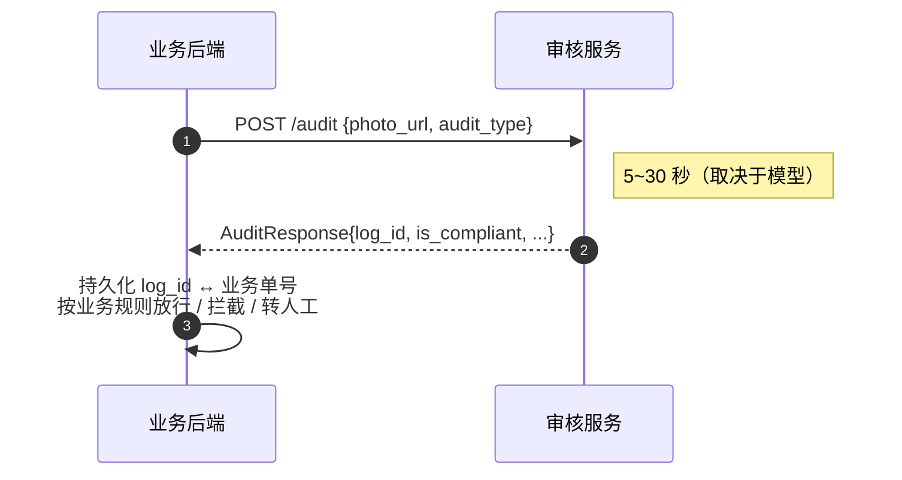
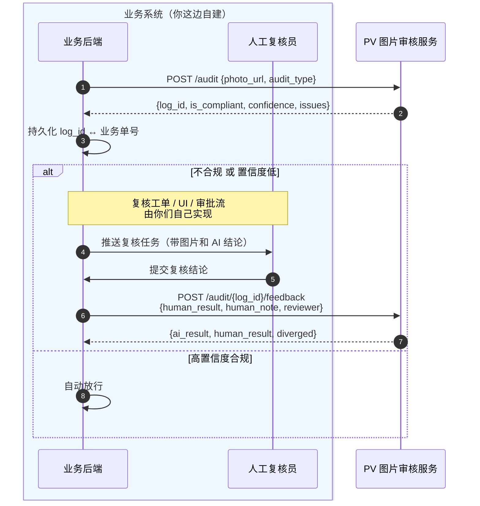

# PV 图片审核服务 — 业务系统对接规范

**目标读者**：调用本服务的业务系统开发人员。
**版本**：v1.1（2026-06-03）
**文档定位**：本规范是业务方对接所需的**唯一文档**，自包含全部字段定义、调用流程、错误码、最佳实践。

---

## 1. 快速开始

### 1.1 你需要拿到什么

对接前，请向审核服务管理员索取：

| 项 | 说明 | 形如 |
|---|---|---|
| 服务地址 | 审核服务的 base URL | `https://audit.example.com` |
| sk | 你的应用专属 API Key | `sk-xxxxxxxxxxxxxxxx` |
| 已开通的 audit_type | 你的业务被允许使用的审核类型 | `wall_crack`、`precast_roof`、`image_tamper` |

> **sk 使用说明**：sk 仅在创建时返回一次，请妥善保管。建议使用配置中心或密钥管理服务存储，**禁止硬编码到代码或提交到 git**。

### 1.2 最小可用示例

5 行代码完成一次审核：

```bash
curl -X POST https://audit.example.com/api/v1/audit \
  -H "Authorization: Bearer sk-xxxxxxxxxxxxxxxx" \
  -H "Content-Type: application/json" \
  -d '{"photo_url":"https://your-cdn.com/photo.jpg","audit_type":"wall_crack"}'
```

返回：

```json
{
  "log_id": 12345,
  "audit_type": "wall_crack",
  "is_compliant": true,
  "confidence": 0.92,
  "issues": [],
  "suggestions": [],
  "detail": {}
}
```

---

## 2. 核心接口（业务对接只用这 5 个）

| 接口 | 用途 | 鉴权 |
|---|---|---|
| `POST /api/v1/audit` | 提交审核（同步 / 同步+异步混合） | ✅ Bearer sk |
| `GET /api/v1/audit/async/{task_id}` | 查询异步任务状态 | ✅ Bearer sk |
| `POST /api/v1/audit/async/{task_id}/redeliver` | 手动触发回调重发 | ✅ Bearer sk |
| `POST /api/v1/audit/{log_id}/feedback` | 回传人工复核结果 | ✅ Bearer sk |
| `GET /api/v1/health` | 健康检查（用于探活） | ❌ |

详细字段定义见 [§16 接口字段定义](#16-接口字段定义)，调用时序见 [§6 调用时序](#6-调用时序)，**异步回调机制见 [§7 异步审核与回调](#7-异步审核与回调)**。

---

## 3. 鉴权规范

### 3.1 请求头

所有需要鉴权的接口必须携带：

```
Authorization: Bearer <sk>
```

注意：

- `Bearer` 与 sk 之间**只有一个空格**
- sk 大小写敏感
- 错误的鉴权头会返回 `401`，且 `WWW-Authenticate: Bearer` 响应头会被设置

### 3.2 sk 管理建议

| 做 | 不做 |
|---|---|
| ✅ 存储到配置中心 / KMS / Vault | ❌ 写到代码、注释、README |
| ✅ 通过环境变量注入 | ❌ 提交到 git（任何分支） |
| ✅ 不同环境用不同 sk（dev / staging / prod） | ❌ 多个业务共用一个 sk |
| ✅ 怀疑泄漏立即联系管理员禁用 | ❌ 通过即时通讯工具明文传递 |

---

## 4. 图片接入要求

### 4.1 photo_url 必须满足

- ✅ **HTTPS** 协议（推荐，HTTP 会被部分网络环境拦截）
- ✅ **公网可达** —— 审核服务是从自己服务器发起 GET 请求下载图片
- ✅ **无需鉴权** —— 不能要求 cookie、Bearer Token、签名头才能访问；可以使用预签名 URL（OSS / S3 presigned URL）
- ✅ **直接返回图片二进制**（`Content-Type: image/jpeg | image/png`），不要返回 HTML 跳转页或 OAuth 重定向

### 4.2 图片本身的限制

| 项 | 限制 |
|---|---|
| 格式 | JPEG / PNG |
| 大小 | ≤ 20 MB |
| URL 有效期 | 建议 ≥ 5 分钟（覆盖审核服务下载 + 推理时长） |
| 失效后访问 | 审核服务**不会重试**，业务方自行处理超时 |

### 4.3 推荐的图片托管方式

```
业务系统 → OSS / S3
        ↓ 生成预签名 URL（5~10 分钟有效）
        ↓
        → 把 URL 传给 /audit 接口
        ↓
        审核服务 GET URL 下载图片
```

不推荐：把图片放在业务系统自己的应用服务器上对外暴露，性能和安全都不好控。

---

## 5. 审核类型（audit_type）

| `audit_type` | 业务含义 | 合规标准 |
|---|---|---|
| `wall_crack` | 墙面裂缝检测 | 无明显裂缝 → `is_compliant=true` |
| `precast_roof` | 预制板屋顶检测（光伏禁止安装在预制板屋顶） | 非预制板 → `is_compliant=true` |
| `image_tamper` | P 图 / 篡改检测 | 风险等级=低风险 → `is_compliant=true` |

> **`is_compliant` 的语义统一**：永远表示"这张图通过本类型的审核"。业务方不需要关心每种类型内部的具体判定逻辑，只看 `is_compliant` 即可。

> **新审核类型**：如果你的业务需要新的审核能力（如电池板缺陷、屋顶坡度等），联系审核服务管理员，他们会基于微调平台开通新的 `audit_type`，对接方式不变。

---

## 6. 调用时序

### 6.1 同步调用模式（推荐）



注意点：

- 审核接口**单次响应时间 5~30 秒**（VLM 推理为主），**不是毫秒级**
- 业务方 HTTP 客户端的 read timeout 至少设 **60 秒**
- 不要在前端线程同步等待——应该在后端任务队列或后台 worker 里调

### 6.2 异步调用模式（高并发场景）

如果业务方调用量大（如批量审核 1000 张图），建议：

```
前端提交 → 业务后端入队列（MQ）→ Worker 消费 → 调 /audit → 写回业务库
                                              ↓
                                          失败重试 3 次（间隔指数退避）
```

不要直接在 HTTP 请求线程里循环调 `/audit`，会把业务系统的 HTTP 线程池打满。

### 6.3 端到端闭环（含人工复核）

把审核 → 人工复核 → 回传串起来看：



> **关于"人工复核员"**：审核服务**不提供**复核 UI、不维护复核员账号体系。复核员是你们业务系统内部的角色，登录、领单、看图、审批都在你们自己的系统里完成。审核服务这边只通过 `/feedback` 接口接收 `reviewer` 字段（工号 / 姓名 / 系统名）作为审计标记。

---

## 7. 异步审核与回调

### 7.1 什么时候用异步

不传 `callback_url` 时，`/audit` 是**纯同步**接口——请求阻塞，5~30 秒后拿到结果。

如果业务方满足以下任一条件，建议改用**同步 / 异步混合模式**：

- 不希望 HTTP 请求线程阻塞 30 秒
- 批量审核（一次提交几百上千张图）
- 网络抖动时同步调用容易超时

### 7.2 工作模式：5 秒切换

传入 `callback_url + callback_token` 后，`/audit` 自动启用以下逻辑：

```
业务系统 ─── POST /audit (含 callback_url) ───→ 审核服务
            ↓
       启动审核 + 5 秒计时
            ↓
   ┌────────┴────────┐
  5 秒内完成        5 秒超时
   ↓                 ↓
返回 200            返回 202 + task_id
+ 完整结果          后台继续跑，完成后回调
```

业务方代码处理两条路径：

```python
resp = httpx.post(
    f"{AUDIT_API}/api/v1/audit",
    headers={"Authorization": f"Bearer {SK}"},
    json={
        "photo_url": "https://your-cdn.com/photo.jpg",
        "audit_type": "wall_crack",
        "callback_url": "https://biz.example.com/audit/callback",
        "callback_token": "biz-secret-1234567890abcdef",  # ≥16 字符
        "external_request_id": "biz-order-123",
    },
)

if resp.status_code == 200:
    handle_audit_result(resp.json())               # 同步路径
elif resp.status_code == 202:
    save_pending_task(resp.json()["task_id"])      # 等回调
else:
    handle_error(resp)
```

### 7.3 接收回调

审核服务会向 `callback_url` 发起 `POST`：

**请求头**

```
Authorization: Bearer {你的 callback_token}
X-Audit-Signature: sha256=<hex>
X-Audit-Task-Id: 99
X-Audit-Attempt: 1
Content-Type: application/json
User-Agent: pv-audit-service/1.0
```

**请求体**

```json
{
  "task_id": 99,
  "log_id": 12345,
  "external_request_id": "biz-order-123",
  "audit_type": "wall_crack",
  "is_compliant": false,
  "confidence": 0.87,
  "issues": ["..."],
  "suggestions": ["..."],
  "detail": {},
  "delivered_at": "2026-06-03T20:35:00+08:00",
  "attempt": 1
}
```

**业务方收到后必须做的 3 件事**

1. **验签**（防伪造）
2. **幂等**（同一 `task_id` 可能因重试被回调多次，按 `log_id` 或 `task_id` 去重）
3. **快速回 200**（5 秒内返回，处理逻辑放队列）

```python
import hmac, hashlib
from fastapi import Request, HTTPException

CALLBACK_TOKEN = os.environ["AUDIT_CALLBACK_TOKEN"]    # 注册时保存的

@app.post("/audit/callback")
async def receive_audit(request: Request):
    body = await request.body()
    signature = request.headers.get("X-Audit-Signature", "")
    expected = "sha256=" + hmac.new(
        CALLBACK_TOKEN.encode(), body, hashlib.sha256
    ).hexdigest()
    if not hmac.compare_digest(signature, expected):
        raise HTTPException(401, "签名校验失败")

    payload = await request.json()
    task_id = payload["task_id"]
    if already_processed(task_id):                       # 幂等
        return {"status": "ok"}
    enqueue_for_processing(payload)                       # 异步处理
    return {"status": "ok"}                               # ⚠️ 必须立刻返回 200
```

> **回调必须返回 2xx 才算送达**。任何 4xx/5xx、超时（30 秒）都视为失败，会触发重试。

### 7.4 重试策略

回调失败会按以下时间间隔重试：

| 第几次 | 距上次失败 | 累计耗时 |
|---|---|---|
| 重试 1 | 10 秒 | 10 秒 |
| 重试 2 | 30 秒 | 40 秒 |
| 重试 3 | 1 分钟 | 1 分 40 秒 |
| 重试 4 | 5 分钟 | 6 分 40 秒 |
| 重试 5 | 30 分钟 | 36 分 40 秒 |
| 重试 6 | 2 小时 | 2 小时 36 分 40 秒 |

第 7 次仍失败 → 任务标记为 `dead`（停止自动重试）。

业务方**修复接收端后**，可以调 `POST /audit/async/{task_id}/redeliver` 手动触发重发。

### 7.5 callback_url 的硬性要求

| 项 | 要求 | 拒绝原因 |
|---|---|---|
| 协议 | 必须 HTTPS | HTTP 会被拒绝 |
| 主机 | 必须公网域名 | IP 字面量、localhost、内网 IP（10.x / 172.16-31.x / 192.168.x）都会被拒，避免 SSRF |
| 鉴权 | 不能要求 cookie / 自定义鉴权头 | 我们只会带 `Authorization: Bearer {callback_token}` 和签名头 |
| 超时 | 必须在 30 秒内返回 | 否则视为失败，会触发重试 |

### 7.6 callback_token 的硬性要求

- ≥ 16 字符
- **每个业务方自己生成自己保存**——审核服务只在收到时验证长度，不参与生成
- **绝对不要使用 sk 作为 callback_token**（两者用途不同：sk 是你身份的证明，callback_token 是我们身份的证明）
- 怀疑泄漏：调一次 `/audit` 时换新 token 即可，旧 token 立即失效（基于"以最后一次提交的为准"原则）

### 7.7 任务查询

```bash
GET /api/v1/audit/async/{task_id}
Authorization: Bearer <sk>
```

返回任务的完整状态（含审核结果、回调投递历史）：

```json
{
  "task_id": 99,
  "log_id": 12345,
  "audit_type": "wall_crack",
  "status": "done",                          // queued / processing / done / failed
  "callback_status": "delivered",            // pending / delivered / failed / dead
  "callback_attempts": 1,
  "last_attempt_at": "2026-06-03 20:35:01",
  "next_attempt_at": null,
  "last_error": "",
  "external_request_id": "biz-order-123",
  "created_at": "2026-06-03 20:30:00",
  "audit_finished_at": "2026-06-03 20:35:00",
  "callback_finished_at": "2026-06-03 20:35:01",
  "audit_result": { ... }                    // status=done 时有值
}
```

> **应用隔离**：你只能查到自己 sk 关联的应用的任务，不能查别人的。

### 7.8 反模式

| ❌ 反模式 | ✅ 正确做法 |
|---|---|
| callback_url 用 IP / localhost / 内网地址 | 用公网 HTTPS 域名 |
| callback_token 复用 sk | 独立生成专门的 callback_token |
| 收到回调后做完业务再返回 200 | 立刻返回 200，业务处理放队列 |
| 不验签直接信任 callback body | 必须用 HMAC 验签 |
| 不做幂等，按收到次数累加业务 | 按 task_id / log_id 去重 |
| dead 后不停手动重发期望成功 | 先修复自己的接收端，再 redeliver |

---

## 8. 人工复核闭环

### 7.1 什么时候应该转人工

业务方根据自己的策略决定，常见做法：

| 策略 | 例子 |
|---|---|
| 不合规直接转人工 | `is_compliant=false` → 推送复核工单 |
| 低置信度转人工 | `confidence < 0.8` → 即使合规也要人工兜一道 |
| 关键业务全转人工 | 涉及金额 > 10 万的订单一律人工复核 |
| AB 灰度 | 10% 流量强制人工，用于对比 AI 准确率 |

### 7.2 必须回传

只要走了人工复核，就**必须**调 `/audit/{log_id}/feedback` 回传结论。原因：

- 帮助审核服务优化 prompt（差异 case 会被自动收集）
- 业务方自己也能在审核服务后台看到自己的 AI / 人工差异统计
- 长期来看，回传越完整，AI 准确率提升越快，业务方人工成本下降越快

> 这是**双赢的契约**：审核服务获得训练数据，业务方获得越来越准的模型。

### 7.3 回传时机

| 时机 | 是否推荐 |
|---|---|
| 复核员一点提交立即回传 | ✅ 推荐 |
| 当天晚上批量回传 | ✅ 可以，建议加重试 |
| 复核员改了多次，每次都回传 | ⚠️ 取最终结论一次回传即可 |
| 不回传 | ❌ 流程不完整，长期会被管理员催 |

### 7.4 reviewer 字段建议

```json
{ "reviewer": "工号 E12345 / 张三" }
```

- 用工号 + 姓名格式，便于审核服务后台审计追溯
- 不要传系统内部的 user_id（管理员看不懂）
- **不要传敏感信息**（手机号、身份证）

---

## 9. 错误码与处理

### 8.1 HTTP 状态码

| 状态码 | 含义 | 业务方应对 |
|---|---|---|
| `200` | 审核完成 | 看 `is_compliant` 走业务流程 |
| `400` | 请求参数错误 / 图片下载失败 / 图片格式不支持 | 检查 `photo_url` 是否可达、`audit_type` 是否拼写正确 |
| `401` | sk 无效或已禁用 | 联系管理员，**不要重试** |
| `404` | `log_id` 不存在（仅 feedback 接口） | 检查是否传错 ID，**不要重试** |
| `422` | 图片分类失败（图片内容无法识别） | 提示业务方上传更清晰的图片 |
| `502` | 模型输出解析失败 | 重试 1 次，仍失败则上报告警 |
| `503` | 模型 / 向量库 / 微调平台暂时不可达 | 指数退避重试（建议 3 次） |
| `504` | 模型推理超时 | 重试 1 次 |
| `5xx` 其他 | 未预期错误 | 上报告警 |

### 8.2 错误响应体

所有错误统一格式：

```json
{ "detail": "具体错误描述" }
```

业务方记录日志时建议同时打印：HTTP 状态码 + `detail` + 自己的请求 ID，便于和审核服务侧排查时对齐。

### 8.3 推荐的重试策略

```python
# 伪代码
RETRYABLE_STATUS = {502, 503, 504}
MAX_RETRIES = 3

for attempt in range(MAX_RETRIES):
    resp = call_audit(...)
    if resp.status_code == 200:
        return resp.json()
    if resp.status_code not in RETRYABLE_STATUS:
        raise BizError(resp)            # 立即失败，不重试
    sleep(2 ** attempt)                 # 1s, 2s, 4s 指数退避
raise BizError("audit service unavailable")
```

**不要重试**的状态：`400 / 401 / 404 / 422`。这些都是参数或权限问题，重试只会浪费 sk 配额。

---

## 10. 性能与配额

### 9.1 单次调用性能参考

| 阶段 | 耗时 |
|---|---|
| 网络往返 + 图片下载 | 0.5 ~ 3 秒（取决于图片大小和网络） |
| VLM 模型推理 | 3 ~ 25 秒（云端 vs 本地 vs 微调） |
| 数据库写日志 | < 50 ms |
| **总计** | **典型 5~15 秒，最坏 30 秒** |

### 9.2 并发与配额

- 当前服务**未设硬性 QPS 限制**，但生产环境建议业务方**自限**（每 sk 不超过 10 QPS）
- 大批量审核场景请提前与审核服务管理员沟通，必要时单独扩容
- `health` 接口**不要**用于普通请求计数，只用于探活（k8s readiness / liveness）

### 9.3 超时建议

| 配置项 | 建议值 |
|---|---|
| HTTP connect timeout | 5 秒 |
| HTTP read timeout | 60 秒 |
| 业务整体超时（含重试） | 180 秒 |

---

## 11. 日志与可观测性

### 10.1 业务方应记录的字段

每次调用 `/audit` 后，建议在业务侧落库以下字段（除业务自有信息外）：

| 字段 | 用途 |
|---|---|
| `log_id` | 关联审核服务的审核记录 |
| `audit_type` | 便于按类型统计 |
| `is_compliant` / `confidence` | AI 判定结果 |
| `request_at` / `response_at` | 计算 RT |
| `http_status` | 错误统计 |
| `human_result`（如有） | 后续与 AI 对比 |

### 10.2 关键告警

业务方至少应配置以下告警（按业务严重度调整阈值）：

- `/audit` 接口 **5xx 比例 > 1%**（持续 5 分钟）
- `/audit` 接口 **P99 延迟 > 30 秒**（持续 5 分钟）
- **图片下载失败率 > 5%**（说明业务方自己的 OSS / 预签名 URL 有问题）
- **feedback 回传堆积 > 100 条**（说明回传链路坏了）

### 10.3 排查问题时

提交工单给审核服务管理员时，请提供：

- 出问题的 `log_id`（最有价值）
- 调用时间（精确到秒，含时区）
- 业务侧请求 ID（如有）
- HTTP 状态码 + `detail` 文本

有 `log_id` 的话，管理员能直接在后台查到该次审核的完整上下文，5 分钟内能定位问题。没有 `log_id` 至少要好几倍时间。

---

## 12. 数据合规

### 11.1 审核服务保存什么

| 数据 | 是否保存 | 保留期 |
|---|---|---|
| `photo_url` | ✅ 保存 | 默认 90 天 |
| 图片二进制 | ❌ 不保存（仅推理时下载到内存） |  |
| `audit_type` / `is_compliant` / `confidence` / `issues` | ✅ 保存 | 默认 90 天 |
| `human_result` / `human_note` / `reviewer` | ✅ 保存 | 默认 90 天 |
| `app_name`（关联到 sk） | ✅ 保存 | 永久（审计） |

### 11.2 业务方需要承诺

- ✅ `photo_url` 中**不包含个人敏感信息**（手机号、身份证号写在 URL 里是禁止的）
- ✅ `human_note` / `reviewer` 中**不包含敏感 PII**
- ✅ 业务方有权对该图片进行 AI 审核（已获得用户授权）
- ✅ 一旦发现 sk 泄漏立即上报

### 11.3 审核服务的承诺

- ✅ 不会将业务图片用于其他业务的训练
- ✅ 仅在业务方授权前提下，将差异 case 用于 prompt 优化
- ✅ 删除 sk 时同步删除关联的 `audit_logs`（如业务方要求）

---

## 13. 联调清单（接入前对照检查）

把这份清单跑完再上生产：

**配置类**

- [ ] 已从管理员处获得 sk，并存入配置中心 / KMS
- [ ] 服务 base URL 区分 dev / staging / prod
- [ ] HTTP 客户端 timeout 设置正确（read ≥ 60 秒）

**功能类**

- [ ] 能成功调通 `/health`
- [ ] 能成功调通 `/audit`，拿到 `log_id` 和判定结果
- [ ] 能成功调通 `/audit/{log_id}/feedback`，看到 `diverged` 字段
- [ ] 业务库已建表存 `log_id`、`is_compliant`、`confidence`

**异常处理类**

- [ ] 401 / 400 不重试
- [ ] 502 / 503 / 504 指数退避重试
- [ ] 超时不会把 HTTP 线程池打满
- [ ] 图片下载失败时业务侧有兜底

**监控类**

- [ ] 接口成功率告警
- [ ] P99 延迟告警
- [ ] feedback 回传积压告警

**安全类**

- [ ] sk 没有出现在 git 仓库中
- [ ] sk 没有写到日志里
- [ ] `photo_url` 不携带敏感 PII

---

## 14. 反模式（不要这样做）

| ❌ 反模式 | ✅ 正确做法 |
|---|---|
| 在前端 JS 里调 `/audit` | 业务后端代理调用，sk 不出后端 |
| 把 sk 写到 frontend 配置 | sk 只能存在后端 / 配置中心 |
| 同步调用 `/audit` 阻塞 HTTP 请求线程 | 走异步队列 / 后台 worker |
| 拿到 `is_compliant=false` 后直接重试期望它变 true | 该转人工就转人工 |
| 不回传 feedback | 必须回传，否则 AI 不会变好 |
| `photo_url` 用业务系统内网地址 | 必须公网可达（OSS 预签名 URL 最佳） |
| `photo_url` 包含 `?id_card=xxx` 等 PII | URL 中不放 PII |
| 多个业务共用一个 sk | 每个业务独立 sk，便于隔离和审计 |
| 401 后不停重试 | 401 立即停，联系管理员 |
| 不记录 `log_id` | 必须记，排查问题全靠它 |

---

## 15. FAQ

**Q: 我可以一次提交多张图片吗？**
A: `/audit` 单次只接受一张。批量场景请业务方自己并发调用（建议 ≤ 10 并发 / sk）。

**Q: 模型判错了怎么办？**
A: 走人工复核 → 回传 feedback。审核服务管理员会定期分析差异 case 并优化 prompt，新 prompt 上线后业务方无感知。

**Q: 我的图片是 base64，可以直接传吗？**
A: `/audit` 接口只接受 `photo_url`。如果你的图片是 base64，先上传到 OSS 拿 URL 再调。`/api/v1/review` 接受 base64 但**不向业务系统开放**。

**Q: 我能查到自己应用的所有审核记录吗？**
A: 当前管理后台不区分应用查询。需要的话联系管理员协调（按 `app_name` 过滤即可）。

**Q: sk 能不能轮换？**
A: 可以。流程：管理员给你新 sk → 你切换配置 → 灰度验证 → 让管理员禁用旧 sk。**不要直接删旧 sk**，会影响存量审计记录的应用归属。

**Q: 审核服务挂了怎么办？**
A: 业务方应有降级策略：① 走人工兜底；② 或临时跳过审核（仅限低风险业务）；③ 缓存请求等服务恢复后重放。**不要无限重试把队列打爆**。

---

## 16. 联系方式

| 场景 | 联系方式 |
|---|---|
| 申请 sk / 开通新 audit_type | 审核服务管理员 |
| 接口报错排查（带 log_id） | 审核服务管理员 |
| 性能 / 容量诉求 | 审核服务管理员 |
| 紧急故障（生产 sk 泄漏 / 服务全挂） | _填上你们团队的 oncall 渠道_ |

---

## 17. 接口字段定义

### 17.1 `POST /api/v1/audit` 提交审核

**请求**

```
POST /api/v1/audit
Content-Type: application/json
Authorization: Bearer <sk>
```

**请求体（`AuditRequest`）**

```json
{
  "photo_url": "https://example.com/photo.jpg",
  "audit_type": "wall_crack",

  "callback_url": "https://biz.example.com/audit/callback",
  "callback_token": "biz-secret-1234567890abcdef",
  "external_request_id": "biz-order-123"
}
```

| 字段 | 类型 | 必填 | 约束 | 说明 |
|---|---|---|---|---|
| `photo_url` | string | ✅ | 公网可达的 HTTPS URL | 图片地址，详见 [§4 图片接入要求](#4-图片接入要求) |
| `audit_type` | string | ✅ | 取值见 [§5](#5-审核类型audit_type) | 审核类型 |
| `callback_url` | string | ❌ | 公网 HTTPS 域名，详见 [§7.5](#75-callback_url-的硬性要求) | 传了即启用同步/异步混合模式 |
| `callback_token` | string | ❌ | ≥16 字符，传 `callback_url` 时**必填** | 用于 HMAC 签名 |
| `external_request_id` | string | ❌ | 任意字符串 | 业务方关联 ID，回调时原样返回 |

**响应体（`AuditResponse`）**

```json
{
  "log_id": 12345,
  "audit_type": "wall_crack",
  "is_compliant": false,
  "confidence": 0.87,
  "issues": ["墙面存在明显裂缝"],
  "suggestions": ["建议加固后再安装"],
  "detail": {}
}
```

| 字段 | 类型 | 说明 |
|---|---|---|
| `log_id` | int | 审核记录 ID。**必须保存**，回传人工复核结果时要用 |
| `audit_type` | string | 回显请求中的审核类型 |
| `is_compliant` | bool | 是否通过本次审核（`true` = 合规 / 通过） |
| `confidence` | float | 置信度，范围 `0.0 ~ 1.0` |
| `issues` | string[] | 发现的问题清单（合规时通常为空） |
| `suggestions` | string[] | 改进建议（可能为空） |
| `detail` | object | 不同审核类型的扩展字段，结构见下表 |

**`detail` 字段说明**

| `audit_type` | `detail` 结构 |
|---|---|
| `wall_crack` | `{}`（空对象） |
| `precast_roof` | `{}`（空对象） |
| `image_tamper` | 含 `risk_level` / `qr_found` / `qr_api_status` / `photo_time` / `photo_address` / `exif_risk` / `ela_risk` 等子字段 |
| 微调动态类型 | `{ "forwarded_to": "finetune_platform", "project_id": "..." }` |

`image_tamper` 的 `detail` 示例：

```json
{
  "risk_level": "低风险",
  "qr_found": true,
  "qr_api_status": "ok",
  "photo_time": "2026-05-21 16:22:37",
  "photo_address": "上海市浦东新区...",
  "exif_risk": "低风险",
  "ela_risk": "低风险"
}
```

**响应说明：200 vs 202**

| 状态码 | 触发条件 | 含义 |
|---|---|---|
| `200` | 不传 `callback_url`，或传了但 5 秒内审核完成 | body 是 `AuditResponse`，含完整审核结果 |
| `202` | 传了 `callback_url` 且 5 秒未完成 | body 是 `AuditAcceptedResponse`，含 `task_id`，结果将通过回调送达 |

**`AuditAcceptedResponse`**

```json
{
  "task_id": 99,
  "log_id": 0,
  "status": "processing",
  "message": "审核耗时超过同步阈值，已转后台处理，结果将通过回调送达"
}
```

| 字段 | 类型 | 说明 |
|---|---|---|
| `task_id` | int | 异步任务 ID，用于查询和重发 |
| `log_id` | int | 审核记录 ID（202 时通常为 0，审核完成后才有） |
| `status` | string | `queued` / `processing` |
| `message` | string | 文本说明 |

---

### 17.3 `GET /api/v1/audit/async/{task_id}` 查询异步任务

**请求**

```
GET /api/v1/audit/async/{task_id}
Authorization: Bearer <sk>
```

**响应体（`AsyncAuditTaskResponse`）**

```json
{
  "task_id": 99,
  "log_id": 12345,
  "audit_type": "wall_crack",
  "status": "done",
  "callback_status": "delivered",
  "callback_attempts": 1,
  "last_attempt_at": "2026-06-03 20:35:01",
  "next_attempt_at": null,
  "last_error": "",
  "external_request_id": "biz-order-123",
  "created_at": "2026-06-03 20:30:00",
  "audit_finished_at": "2026-06-03 20:35:00",
  "callback_finished_at": "2026-06-03 20:35:01",
  "audit_result": {
    "audit_type": "wall_crack",
    "is_compliant": false,
    "confidence": 0.87,
    "issues": [...],
    "suggestions": [...],
    "detail": {}
  }
}
```

| 字段 | 类型 | 说明 |
|---|---|---|
| `status` | string | `queued` / `processing` / `done` / `failed` |
| `callback_status` | string | `pending` / `delivered` / `failed` / `dead` |
| `callback_attempts` | int | 已尝试回调的次数（含成功） |
| `next_attempt_at` | string \| null | 下次重试时间（`callback_status=failed` 时有效） |
| `last_error` | string | 最近一次失败的错误信息（用于排障） |
| `audit_result` | object \| null | `status=done` 时是完整结果，等同于回调 body |

**错误码**：`404` — 任务不存在或不属于当前应用。

---

### 17.4 `POST /api/v1/audit/async/{task_id}/redeliver` 手动触发回调重发

**请求**

```
POST /api/v1/audit/async/{task_id}/redeliver
Authorization: Bearer <sk>
```

无请求体。

**响应**

```json
{
  "task_id": 99,
  "callback_status": "pending",
  "message": "已排队重发，预计 5 秒内由后台 worker 触发"
}
```

**错误码**

| 状态码 | 含义 |
|---|---|
| `400` | 任务不在 `done` 状态（无法重发） |
| `404` | 任务不存在或不属于当前应用 |

---

### 17.2 `POST /api/v1/audit/{log_id}/feedback` 回传人工复核结果

**请求**

```
POST /api/v1/audit/{log_id}/feedback
Content-Type: application/json
Authorization: Bearer <sk>
```

**路径参数**

| 字段 | 类型 | 说明 |
|---|---|---|
| `log_id` | int | `/audit` 返回的审核记录 ID |

**请求体（`HumanFeedbackRequest`）**

```json
{
  "human_result": false,
  "human_note": "现场确认为预制板，AI 误判为非预制板",
  "reviewer": "工号 E12345 / 张三"
}
```

| 字段 | 类型 | 必填 | 说明 |
|---|---|---|---|
| `human_result` | bool | ✅ | 人工判断：`true` = 合规，`false` = 不合规 |
| `human_note` | string | ❌ | 备注，建议写明与 AI 判断差异的原因 |
| `reviewer` | string | ❌ | 复核人标识（工号 / 姓名 / 系统名）；为空时使用 sk 关联的应用名 |

**响应体（`HumanFeedbackResponse`）**

```json
{
  "log_id": 12345,
  "ai_result": true,
  "human_result": false,
  "diverged": true,
  "status": "ok"
}
```

| 字段 | 类型 | 说明 |
|---|---|---|
| `log_id` | int | 路径参数回显 |
| `ai_result` | bool | AI 原始判断（取自原审核记录） |
| `human_result` | bool | 人工复核结论 |
| `diverged` | bool | AI 与人工是否存在差异（`true` = 不一致） |
| `status` | string | 固定值 `"ok"` |

**错误码**：`404` — `log_id` 不存在。

---

### 17.5 `GET /api/v1/health` 健康检查

**请求**

```
GET /api/v1/health
```

不需要鉴权。

**响应体**

```json
{
  "status": "healthy",
  "ollama": "connected",
  "sqlite": "connected"
}
```

| 字段 | 类型 | 取值 |
|---|---|---|
| `status` | string | `healthy`（全部正常）/ `degraded`（任一依赖异常） |
| `ollama` | string | `connected` / `disconnected` |
| `sqlite` | string | `connected` / `disconnected` |

> 用法：作为 Kubernetes 的 readiness / liveness 探针，或作为业务方降级判断依据。**不要**用于普通业务请求前的预检。

---

## 18. 变更记录

| 日期 | 版本 | 变更 |
|---|---|---|
| 2026-06-03 | v1.0 | 首版 |
| 2026-06-03 | v1.1 | 删除对内部文档的引用，把字段定义内嵌为 §16，使本规范完全自包含 |
| 2026-06-03 | v1.2 | 文档发布到独立对外仓库，由源仓库自动同步生效 |
| 2026-06-03 | v2.0 | 新增异步审核 + 回调机制（§7）：支持 5 秒同步否则异步 + HMAC 签名 + 重试退避；新增 `AsyncAuditTaskResponse` 字段（§17.3）和重发接口（§17.4） |
